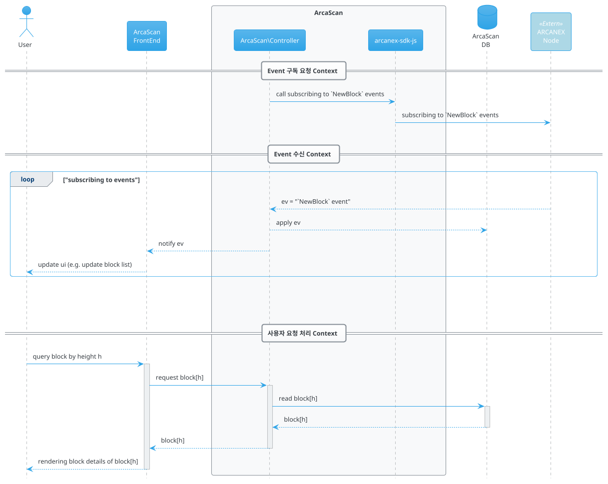
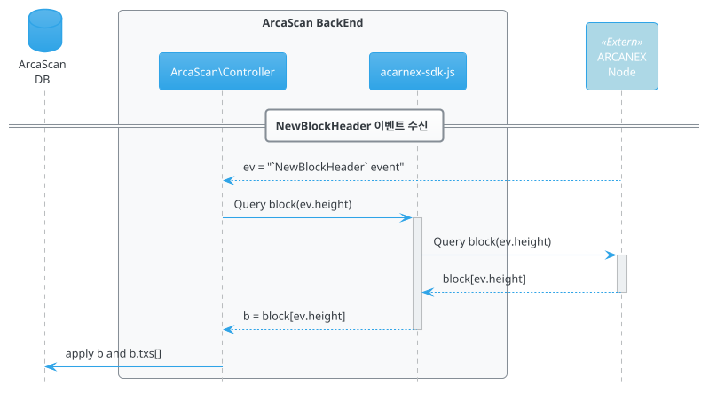
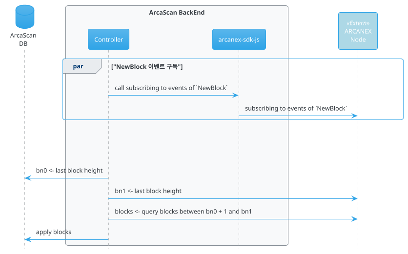

# Overview

이 문서는 ARCANEX Blockhcain 의 Block Explorer 인 **ArcaScan** 에 대한 구성 요구사항 및 기능 요구사항에 대하여 기술한다.

```plantuml
@startuml
!include https://raw.githubusercontent.com/plantuml-stdlib/C4-PlantUML/master/C4_Component.puml

Container_Ext(browser, "Browser")
System_Boundary(explorer, "Block Explorer") {
    Container(fe, "FrontEnd")
    Container(be, "BackEnd") {
        Component(bzl, "Controller")
        Component(sdk, "SDK")
    }
    
    Container(db, "Database")
}
Container(node, "ARCANEX Node")

BiRel_R(browser, fe, "Request", "HTTP/HTTPS")
Rel_D(fe, bzl, "API", "")
Rel_R(bzl, sdk, "API", "")
Rel_D(bzl, db, "CRUD", "")
BiRel_R(sdk, node, "RPC", "HTTP/JSONRPC, Websocket")
@enduml
```

ArcaScan 은 ARCANEX 네트워크에서 생성되는 블록, 트랜잭션 그리고 계정 관련 상태 변경 정보를
실시간으로 사용자에게 제공하기 위한 웹 서비스 시스템이다.  

일반적인 Block Explorer 시스템은 블록체인 노드에 접속하여 필요한 정보를 획득 하고, 
이를 적절한 구조로 변형하여 DB 에 저장함으로서 블록체인 원장과 Explorer DB 를 동기화 한 후.
그리고 사용자로 부터 요청을 수신하였을 때, DB 데이터를 기반으로 응답을 생산하는 것을 기본 기능으로 구현된다.  

ArcaScan 역시 일반적인 Block Explorer 와 유사한 구조로 구현된다.
ARCANEX 네트워크와의 연결을 동한 정보 획득, 획득된 정보의 DB 저장을 통한 동기화, 그리고 DB 정보에 기반한 사용자 요청 응답으로 기본 기능을 구성한다.

## Synchronization

ArcaScan 은 이벤트 구독 방식으로 ARCANEX 네트워크에서 발생되는 모든 블록과 트랜잭션 정보를 획득 한다.
ARCANEX 네트워크를 구성하는 노드 중 하나로 Websocket 연결을 생성하고,
이 연결을 통해 [이벤트 쿼리문](../../subscriber.md#event-query)을 포함한 구독 요청 메시지를 전송함으로서 실시간으로 이벤트를 수신 할 수 있다.
이벤트 구독 대한 자세한 사항은 [Event Subscribe](../../subscriber.md)를 참조한다.

구독 메커니즘을 통해 수신되는 이벤트에 포함되는 정보는 현재 시점의 정보로 제한된다. (과거 이벤트 정보 수신 불가)  
따라서 과거 시점에 발생한 정보를 조회 하기 위해서는 ARCANEX 노드가 제공하는 RPC 호출을 통해 해당 정보를 획득해야 한다.
ARCANEX RPC 호출을 위한 API 에 대한 자세한 정보는 [ACNet](../../acnet.md) 를 참조한다.  



이벤트 구독을 통해 획득한 모든 블록과 트랜잭션 정보는 적절한 형태로 DB에 반영됨으로서 블록체인 원장과 DB 사이의 동기화는 완료된다.  
여기서 적절한 형태란 사용자 요청에 대한 응답을 가장 효과적으로 할 수 있게 하기 위한 데이터 구조를 의미하며 ArcaScan 시스템 설계 과정에서 정의되어야 한다.

### Runtime Synchronization
ARCANEX 네트워크에서 새로운 새로 생성되는 모든 블록과 트랜잭션은 이벤트 구독을 통해 실시간에 가깝게 ArcaScan DB 와 동기화 되어야 한다.  
이벤트 구독 요청시 이벤트 타입(`tm.event`)을 `NewBlock` 또는 `NewBlockHeader` 로 지정하면 블록이 생성될 때 마다 이벤트를 수신할 수 있게 된다.
`NewBlock` 으로 이벤트를 구독하는 경우, 수신되는 이벤트에는 해당 블록에 포함된 모든 트랜잭션 정보를 포함하고 있다.
반면에 `NewBlockHeader`로 구독하는 경우, 수신되는 이벤트에는 해당 블록에 포함된 트랜잭션의 수만 포함된다. 
따라서 `NewBlockHeader`로 이벤트를 구독하는 경우, 트랜잭션이 포함된 블록 정보를 별도의 RPC 요청을 통해 획득 하여야 한다.



`NewBlockHeader` 이벤트에 포함된 블록 정보는 다음과 같다.

```json
{
  "query": "tm.event='NewBlockHeader'",
  "data": {
    "type": "tendermint/event/NewBlockHeader",
    "value": {
      "header": {
        "version": {
          "block": "11",
          "app": "4294967296"
        },
        "chain_id": "localnet",
        "height": "92175",
        "time": "2023-02-13T13:27:58.840771Z",
        "last_block_id": {
          "hash": "525B7E1B39ABFF6643D5CA0AF2B4C080AA69B8F6E6B88F5D96FA1C4B669EDA57",
          "parts": {
            "total": 1,
            "hash": "518791BB1F931395B3036C8E9AEC40E92498FE30A582F8DF871790A6A48CCD33"
          }
        },
        "last_commit_hash": "CC16D8C757360897B9682646F2D910ECC77A2A80EED54AE06D0539E365B77164",
        "data_hash": "E3B0C44298FC1C149AFBF4C8996FB92427AE41E4649B934CA495991B7852B855",
        "validators_hash": "FE36DFA0965A3207F370004FD5A35B0D9CFE22C1E5EC6282B11E0A078E022C11",
        "next_validators_hash": "FE36DFA0965A3207F370004FD5A35B0D9CFE22C1E5EC6282B11E0A078E022C11",
        "consensus_hash": "048091BC7DDC283F77BFBF91D73C44DA58C3DF8A9CBC867405D8B7F3DAADA22F",
        "app_hash": "F05DE653A484B266512480747A80522450D9241D3AE43E5FB49FBB6613FB07CF",
        "last_results_hash": "E3B0C44298FC1C149AFBF4C8996FB92427AE41E4649B934CA495991B7852B855",
        "evidence_hash": "E3B0C44298FC1C149AFBF4C8996FB92427AE41E4649B934CA495991B7852B855",
        "proposer_address": "8DC41A86B91EB88D82489C4D037AE9FFCA65CFBF"
      },
      "num_txs": "0",
      "result_begin_block": {},
      "result_end_block": {
        "validator_updates": []
      }
    }
  },
  "events": {
    "tm.event": [
      "NewBlockHeader"
    ]
  }
}  
```

`NewBlock` 이벤트에 포함되는 블록 정보는 다음과 같다.

```json
{
  "block_id": {
    "hash": "18711607956F44E83677F90D1BEEDCD5EA44BB27CBFB382A4DA64EE06189343D",
    "parts": {
      "total": 1,
      "hash": "F1D3B921EFD098157598A810DC6CB0C04D3AA475B293D23F15B1FC2073C44774"
    }
  },
  "block": {
    "header": {
      "version": {
        "block": "11",
        "app": "4294967296"
      },
      "chain_id": "localnet",
      "height": "79040",
      "time": "2023-02-13T04:56:07.98802Z",
      "last_block_id": {
        "hash": "6021C2A2CD2438FF61CE476B76D97997E6AE19AB30BCDE40C4BB7137F53AC30E",
        "parts": {
          "total": 1,
          "hash": "2F35010188F2F313F00B9374E329A71249ECDEEBA5E5ADBD2BDAE386DC3101B2"
        }
      },
      "last_commit_hash": "BA6B2B6E9A4603C86F5DDE683E63C48DC3EBD83EEBEB63D1D70DE694443884C5",
      "data_hash": "E3B0C44298FC1C149AFBF4C8996FB92427AE41E4649B934CA495991B7852B855",
      "validators_hash": "FE36DFA0965A3207F370004FD5A35B0D9CFE22C1E5EC6282B11E0A078E022C11",
      "next_validators_hash": "FE36DFA0965A3207F370004FD5A35B0D9CFE22C1E5EC6282B11E0A078E022C11",
      "consensus_hash": "048091BC7DDC283F77BFBF91D73C44DA58C3DF8A9CBC867405D8B7F3DAADA22F",
      "app_hash": "0E1AD984FD0FE8A1B2C4B0D23A610C9787F56D563BF8157C188E99BA4064D852",
      "last_results_hash": "E3B0C44298FC1C149AFBF4C8996FB92427AE41E4649B934CA495991B7852B855",
      "evidence_hash": "E3B0C44298FC1C149AFBF4C8996FB92427AE41E4649B934CA495991B7852B855",
      "proposer_address": "8DC41A86B91EB88D82489C4D037AE9FFCA65CFBF"
    },
    "data": {
      "txs": [
        "CAEQwKK/6piI36AXGJoIIhTEYfux+YzfUycqPFBZp2SsYziBXCoUrjsLNQASnt99xA4njqI1k3RaF4QyAgLEOgEKQAFSQdLVXe+ELBnuS2vF0OwYlfDNgurj0IWiBXGdq8cpaO81M6qvwyiGb8Mr6ZWOnD3/nDvWEkKCSKVWuS+Ld4bXg1wA",
        "CAEQkK/A6piI36AXGJoIIhQAQCOcw9QIFDgBqNRXMYBk7BBd/yoUfEskb4RzA8QqK4B2H39FIVpmxAUyAgLEOgEKQAFSQVPT9NJZ426c89CotpatqndouTxORCt94204obWs6RlXa1e2vSpZwrFkfCn409SsoIkPrQUoXm29K/dWzoJvatIB",
        "CAEQkKbD6piI36AXGJoIIhSNFO5EqCyixc74BbcNjB0kDbooISoUMLAlEfyMyew1LDPiOyR8dqPntqgyAgLEOgEKQAFSQcz4UOU5qT9H8txblik9sYiCBrS3dkO7/v/AwPgjR31HIdK1RFd7Gvi5aNOC12WBDVNrPzX/s14zwH9vG9LEXJsB",
        "CAEQ+KfF6piI36AXGJoIIhQRkD2yGoCJ2LplnWugmZteVqGJLCoUb6EpBDEV3C1kjGLETUsdVClZmnkyAgLEOgEKQAFSQUTYppjNZzJiv73eBd4iVL0MZRFefI27+1F7DclBN/PUVgO3ymip5wo9oDmjujjX+JRug0WJZ75Huyuc9229CoAA",
        "CAEQmKbQ6piI36AXGJoIIhQ923KOXCHGdek8olfpLuS6Bq8RjyoUcdqwpyeP8PU+s7QVP+ZaIv3NXqgyAgLEOgEKQAFSQXdmLY21GvElXS54SMShK+VTGhn5y+6DbayWD4NMBeM2A9E3Fuus5PjQgYuofZNN6BOS3zUuTogdCj5jMIRMTV0A",
        "CAEQoMrR6piI36AXGJoIIhTtwwfQPUjSDuS+fNE8FfLD1GJXlyoUZxMNYNR9J+jqpNUFkBClkG8XqS0yAgLEOgEKQAFSQcRZEHGNiMQuxh6rYucuLb6w3LP9x4pYGq54f3XP/654Fxf2zANuO01cPkQTZdhi0Y2JaTEnjJ5OCpY+ctOs1wwA",
        "CAEQiNjP6piI36AXGJoIIhQUFOQiWO8r7++FWhg7jOkucHR/SyoU2KU7DNCsqsSOEWZTjtrittYSBlkyAgLEOgEKQAFSQU04aE+ZAJ7W7V9Kv5zu7Rz7e1CDuUtq3kSOc1FedKSQaCCuXqF2/x5RSc1Ix19ksY89UBUbxf9J4QBp/0D/saAA",
        "CAEQkPPT6piI36AXGJoIIhSzK8vw2EZt+BNCYr7RCMa6SCvtdyoUssY9flobuPJRnY9xdsLa3slx40AyAgLEOgEKQAFSQQA5/AS+cwqb7D89In8Qsnm1EYYkvJlLS/Iyt5qJlRy1SrVmBP+GRfv1H8m7pHGk1sdvv42EydP3sNZAcU3YccgA",
        "CAEQ6KbV6piI36AXGJoIIhRh8JfNVC+0RFKIvBUuxz+WEstDHioUNiw81aRP6L6KD03GCBVLCmiU814yAgLEOgEKQAFSQWy45CDU57VHi4O7AmZuCpd5HYfJCATP651y4ZIQi+uYUHojMZgcDsG7euId5oqKX4+1BN/Zplw6/IcL8hTANgAB"
      ]
    },
    "evidence": {
      "evidence": []
    },
    "last_commit": {
      "height": "79039",
      "round": 0,
      "block_id": {
        "hash": "6021C2A2CD2438FF61CE476B76D97997E6AE19AB30BCDE40C4BB7137F53AC30E",
        "parts": {
          "total": 1,
          "hash": "2F35010188F2F313F00B9374E329A71249ECDEEBA5E5ADBD2BDAE386DC3101B2"
        }
      },
      "signatures": [
        {
          "block_id_flag": 2,
          "validator_address": "8DC41A86B91EB88D82489C4D037AE9FFCA65CFBF",
          "timestamp": "2023-02-13T04:56:07.98802Z",
          "signature": "fZSeqx8Ut+6yfoPl3bN5uX8hCF7p8i9H1a73EyOcdExH70SYmmqiybdFym64kImk2oW868R+8lI/ulYj3Uu0Xg=="
        }
      ]
    }
  }
}
```

### History Synchronization

ArcaScan 이 최초 구동 또는 재구동될 때, 
ArcaScan DB 와 ARCANEX 블록체인 원장은 동기화 되지 않은 상태이다.
ArcaScan DB 는 블록번호 `bn0` 까지의 정보를 적용한 상태인데,
ARCANEX 블록체인은 이미 블록번호 `bn1` 까지 생성된 상황이 가능하다.  
때문에 ArcaScan 는 구동 시작시, 
DB에 반영된 마지막 블록 번호(`bn0`)와 
현재 ARCANEX 블록체인의 마지막 블록 번호(`bn1`) 를 조회 하여,
그 사이에 발생한 모든 블록 정보가 DB에 반영(동기화) 되도록 해야 한다.

ArcaScan 이 구동되지 않은 시간동안 생성된 블록에 대한 정보는 이벤트 구독 방식으로 획득이 불가능하고,
[블록 관련 RPC 호출을 수행하는 ACNet의 API](../../acnet.md#block)를 호출 하는 것으로만 획득이 가능하다.



블록 조회를 위한 RPC 호출의 응답에 포함된 블록정보는, `NewBlock` 이벤트에 포함된 블록 정보와 동일하다.  

과거 상태 정보 동기화시 주의해야 할 점은, 동기화 수행시 누락되는 블록이 발생할 수 있다는 것이다.
예를 들어, DB에 반영된 마지막 블록 번호가 `m` 이고, ARCANEX 블록체인의 마지막 블록 번호가 `n, (n>m)` 으로 조회 되었을 경우, 
블록 `n`까지 블록을 조회 하여 이를 DB에 반영하는 사이에 ARCANEX 네트워크에서 블록 `n+1` 이 생성될 가능성이 있다.  
이 경우, 다음 두가지를 문제를 해결 해야 한다.

1. 이벤트 구독 요청을 먼저 해 두지 않은 경우, 블록 `n+1`은 DB에 적용될 기회를 영원히 잃게 된다.
2. 이벤트 구독 요청을 하여 블록 `n+1`을 수신하였더라도, 이를 DB에 반영하는 것은 블록 `n` DB 반영 이후가 되어야 한다.

!!! tip
    선행하는 이벤트 구독으로 수신되는 블록 정보를 큐에 적재 하고,
    DB의 마지막 블록 다음 부터 큐의 첫번째 적재 블록 앞까지 RPC 호출을 통한 과거 블록 동기화를 진행한다.
    과거 블록 동기화가 완료되면, 큐에 적재된 블록에 대한 DB 반영을 수행 하는 것이다.


## Block

ArcaScan은 실시간으로 ARCANEX 네트워크에서 생성되는 블록 정보를 구독하여 DB에 저장하고,
이를 이용하여 아래의 사용자 요청을 수행한다.

### Lastest Block Height

사용자 브라우저에 최신 블록 번호(Block Height) 가 실시간으로 표시 된다.  
이는 블록 생성 이벤트를 수신할 때 마다 이벤트에 포함된 블록 번호로 사용자 브라우저의 화면을 업데이트 하도록 구현 한다. 

### Latest Block List

최근 블록 X개 가 목록 형태로 표시된다.
블록 생성 이벤트가 수신될 때 마다 이 목록은 업데이트 되어야 한다.

하나의 블록당 표시되어야 하는 최소 정보는 다음과 같다.

- 블록 번호
- 블록 해시
- 블록 생성 시간
- 블록의 수수료
- 블록이 포함하는 트랜잭션 개수
- 그 외 정보

`블록 번호` 와 `블록 해시` 를 선택할 경우, 해당 `블록 상세 정보`(Block Detail) 화면 으로 이동 한다.


### Block Detail
사용자로 부터 블록 번호(height) 또는 블록 해시를 입력받아, 해당 블록의 상세 정보를 보여 준다.
블록 정보중 최소 다음의 정보가 표시되어야 한다.

- `block.header.height` : 블록 번호
- `block_id.hash`: 블록 해시
- `block.header.version.block` : 블록 버전
- `block.header.chain_id` : 체인 ID
- `block.header.time` : 블록 생성 시간
- `block.header.proposer_address` : 블록 제안자 주소 (Block proposer's address)
- `block.data.txs` : 트랜잭션 목록 (트랜잭션 해시 목록)
- `block.last_commit.hegith` : 이전 블록 번호
- `block.last_commit.block_id.hash` : 이전 블록 해시

### Block Search

ArcaScan 이 제공하는 검색창을 통하여 Block 을 조회할 수 있다.
검색 조건으로 지정할 수 있는 값은 다음과 같다.

- Block Hash  
블록의 해시값으로 해당 블록을 조회 한다.
조회 결과는 `Block Detail` 화면으로 출력한다.

- Block Height  
블록 번호로 해당 블록을 조회 한다.
조회 결과는 `Block Detail` 화면으로 출력한다.

## Transactions

### Transaction List

트랜잭션 목록을 조회하여 출력한다.


- Block Height  
특정 블록에 포함된 트랜잭션 목록을 출력한다.
- 
- by account address

### Transaction Search

- by txhash

## Account
 - by address
 
## Validators

- validators at now
- total delegatees at now
- vaidators at the block height

## Governance

- proposal list at now
- proposal list at the block height
- proposal details (+ voting status and result)