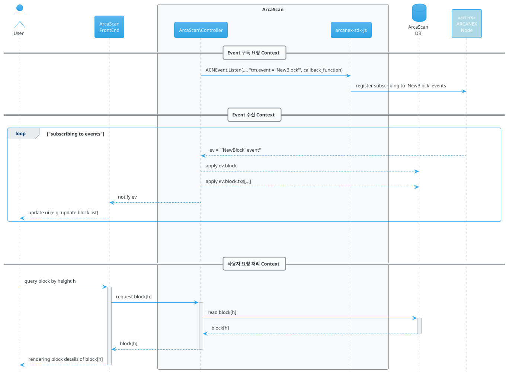
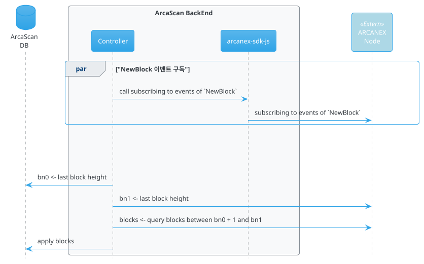

# Overview

이 문서는 ARCANEX Blockhcain 의 Block Explorer 인 **ArcaScan** 에 대한 구성 요구사항 및 기능 요구사항에 대하여 기술한다.

```plantuml
@startuml
!include https://raw.githubusercontent.com/plantuml-stdlib/C4-PlantUML/master/C4_Component.puml

Container_Ext(browser, "Browser")
System_Boundary(explorer, "Block Explorer") {
    Container(fe, "FrontEnd")
    Container(be, "BackEnd") {
        Component(bzl, "Controller")
        Component(sdk, "SDK")
    }
    
    Container(db, "Database")
}
Container(node, "ARCANEX Node")

BiRel_R(browser, fe, "Request", "HTTP/HTTPS")
Rel_D(fe, bzl, "API", "")
Rel_R(bzl, sdk, "API", "")
Rel_D(bzl, db, "CRUD", "")
BiRel_R(sdk, node, "RPC", "HTTP/JSONRPC, Websocket")
@enduml
```

ArcaScan 은 ARCANEX 네트워크에서 생성되는 블록, 트랜잭션 그리고 계정 관련 상태 변경 정보를
실시간으로 사용자에게 제공하기 위한 웹 서비스 시스템이다.  

일반적인 Block Explorer 시스템은 블록체인 노드에 접속하여 필요한 정보를 획득 하고, 
이를 적절한 구조로 변형하여 DB 에 저장함으로서 블록체인 원장과 Explorer DB 를 동기화 한 후.
그리고 사용자로 부터 요청을 수신하였을 때, DB 데이터를 기반으로 응답을 생산하는 것을 기본 기능으로 구현된다.  

ArcaScan 역시 일반적인 Block Explorer 와 유사한 구조로 구현된다.
ARCANEX 네트워크와의 연결을 동한 정보 획득, 획득된 정보의 DB 저장을 통한 동기화, 그리고 DB 정보에 기반한 사용자 요청 응답으로 기본 기능을 구성한다.

## Genesis
ARCANEX 블록체인 원장의 최초 상태 정보가 ArcaScan DB에 반영되어야 한다.
```json
genesis.json
```
## Synchronization

ArcaScan DB는 ARCANEX 블록체인 원장과 동기화 되어야 한다.  

ARCANEX 블록체인 원장과의 동기화는 ARCANEX 블록체인 원장에 기록되는 모든 상태 변경 정보를 수신하여 이를 ArcaScan DB에 재구성함을 의미 하는 것으로,
ArcaScan 이 사용자에게 제공해야 할 기능을 수행하는데 가장 최적화된 형태로 재구성 하여 **ArcaScan DB에 누적 반영** 한다.

ArcaScan 은 이벤트 구독 방식과 RPC 호출 방식을 통해 동기화에 필요한 정보를 획득 한다.  

- 이벤트 구독   
현재 발생되는 정보를 실시간에 가깝게 획득하가 위하여 사용된다.   
ArcaScan은 ARCANEX 네트워크를 구성하는 노드 중 하나로 Websocket 연결을 생성하고,
이 연결을 통해 [이벤트 쿼리문](../../subscriber.md#event-query)을 포함한 구독 요청 메시지를 전송함으로서, 블록과 트랜잭션 정보가 포함된 이벤트를 실시간으로 수신 할 수 있다.
이벤트 구독 대한 자세한 사항은 [Event Subscribe](../../subscriber.md)를 참조한다.

- RCP 호출  
이미 발생한 정보를 획득하기 위하여 사용된다.
이벤트 구독 메커니즘을 통해 수신되는 정보는 현재 시점의 정보로 제한된다. (과거 정보 수신 불가)  
따라서 과거 시점에 발생한 정보를 조회 하기 위해서는 ARCANEX 노드가 제공하는 RPC 호출을 통해 해당 정보를 획득해야 한다.
ARCANEX RPC 호출을 위한 API 에 대한 자세한 정보는 [ACNet](../../acnet.md) 를 참조한다.

ArcaScan DB 동기화를 위해 위와 같은 방법으로 획득 해야 하는 정보는 **블록** 과 **트랜잭션** 정보 이다. 

### Block Sync.

ArcaScan 은 `NewBlock` (또는 `NewBlockHeader`) 이벤트 구독을 요청하고, 해당 이벤트가 수신되면 이를 ArcaScan DB에 반영한다.  
[`NewBlock` 이벤트](../data.md#newblock-event)에 포함되는 블록 정보는 트랜잭션 정보 까지 포함한다.  
반면에 [`NewBlockHeader` 이벤트](../data.md#newblockheader-event)는 해당 블록의 트랜잭션 수를 포함하며 트랜잭션 자체는 포함하지 않는다.
때문에 트랜잭션이 포함된 블록 정보를 획득하기 위하여 추가적인 RPC 호출이 필요하다.  
따라서 본 문서에서는 `NewBlock` 이벤트 구독을 전제로 하여 요구사항을 기술 한다.




### Transaction Sync.

`NewBlock` 이벤트에 포함된 블록 정보에는 트랜잭션이 `protobuf v3`로 직렬화 된 후 base64로 한번더 인코딩 된 형태로 존재한다.
때문에 트랜잭션 동기화를 위해서 `TrxBuild.DecodeTrx` API를 사용한 디코딩 과정이 필요하다.  
`TrxBuild.DecodeTrx` API 는 [`Trx`](../data.md#trx) 를 리턴한다.  
획득된 정보를 재구성하여 ArcaScan DB에 반영한다.

!!! note
    트랜잭션 protobuf message 는 [Data structure](../data.md#protobuf-messages)를 참조한다.


이벤트 구독을 통해 획득한 모든 블록과 트랜잭션 정보를 DB에 반영함 으로서 블록체인 원장과 DB 사이의 동기화는 완료된다.

### Runtime Synchronization

ArcaScan 실행 중 ARCANEX 네트워크에서 신규로 생성되는 모든 블록과 트랜잭션은 실시간에 가깝게 ArcaScan DB 와 동기화 되어야 한다.

### History Synchronization

ArcaScan 이 중지된 기간 동안 발생된 블록과 트랜잭션 정보 역시 ArcaScan DB와 동기화 되어야 한다.

ArcaScan 이 최초 구동 또는 일시 정지 후 재구동될 때, 
ArcaScan DB 와 ARCANEX 블록체인 원장은 동기화 되지 않은 상태이다.
예를 들어 ArcaScan 이 시작 되었을 때, ArcaScan DB 는 블록번호 `bn0` 까지의 정보를 적용한 상태인데 반하여,
ARCANEX 블록체인은 이미 블록번호 `bn1` 까지 생성된 상황이 가능하다.  
때문에 ArcaScan 는 시작시, 
DB에 반영된 마지막 블록 번호(`bn0`)와 
현재 ARCANEX 블록체인의 마지막 블록 번호(`bn1`) 를 조회 하여,
그 사이에 발생한 모든 블록 정보가 DB에 반영(동기화) 되도록 해야 한다.

ArcaScan 이 구동되지 않은 시간동안 생성된 블록에 대한 정보는 이벤트 구독 방식으로 획득이 불가능하고,
[블록 관련 RPC 호출을 수행하는 ACNet의 API](../../acnet.md#block)를 호출 하는 것으로만 획득이 가능하다.



History Sync. 시 누락되는 블록이 발생하지 않도록 구현되어야 한다.
예를 들어, DB에 반영된 마지막 블록 번호가 `m` 이고, ARCANEX 블록체인의 마지막 블록 번호가 `n, (n>m)` 으로 조회 되었을 경우, 
블록 `n`까지 블록을 조회 하여 이를 DB에 반영하는 사이에 ARCANEX 네트워크에서 블록 `n+1` 이 생성될 가능성이 있다.  
이 경우, 다음 두가지를 문제를 해결 해야 한다.

1. 이벤트 구독 요청을 먼저 해 두지 않은 경우, 블록 `n+1`은 DB에 적용될 기회를 영원히 잃게 된다.
2. 이벤트 구독 요청을 하여 블록 `n+1`을 수신하였더라도, 이를 DB에 반영하는 것은 블록 `n` DB 반영 이후가 되어야 한다.

!!! tip
    이벤트 구독으로 수신되는 블록 정보를 바로 DB 반영 하지 않고 큐(메모리)에 적재 한다.   
    - ArcaScan DB 에 반영된 마지막 블록 번호가 `m` 이라 하고,   
    - 첫번째 적재된 블록의 번호를 `n` 이라 할 때,
    `m+1` 부터 `n-1` 까지의 블록을 RPC 호출을 통해 획득하고 이를 ArcaScan DB에 반영(동기화) 해야 한다.
    (과거 블록 동기화 중에도 큐에는 지속적으로 신규 블록이 적재될 것이다.)  
    과거 블록 동기화가 완료되면, 큐에 적재된 신규 블록(블록 `n` 부터)의 DB 반영을 시작한다.


## User Requests

ArcaScan 동기화된 DB 의 내용을 기반으로 하여 다음과 같은 사용자 요청에 응답해야 한다.

## Block

### Lastest Block Height

사용자 브라우저에 최신 블록 번호(Block Height) 가 실시간으로 출력 된다.  
이는 블록 생성 이벤트를 수신할 때 마다 이벤트에 포함된 블록 번호로 사용자 브라우저의 화면을 업데이트 하도록 구현 한다. 

### Latest Block List

최근 블록 X개 가 목록 형태로 출력된다.
블록 생성 이벤트가 수신될 때 마다 이 목록은 업데이트 되어야 한다.


하나의 블록당 표시되어야 하는 최소 정보는 다음과 같다.

- 블록 번호
- 블록 해시
- 블록 생성 시간 (생성후 경과 시간이 1시간 이내인 경우, 경과 시간 표시)
- 블록이 포함하는 트랜잭션 개수
- 블록의 수수료
- 블록의 수수료 수신 계정 주소.
- 그 외 정보

`블록 번호` 와 `블록 해시` 를 선택할 경우, 해당 `블록 상세 정보`(Block Detail) 화면 으로 이동 한다.

### Total Block List
전체 블록이 생성 시간 역순으로, X개 단위로, 페이징 처리되어 표시된다.
X 는 해당 화면에서 선택할 수 있다.

### Block Search

다음과 같은 경우, 입력된 조건에 맞는 블록 정보를 조회 한다.

- 블록 번호가 클릭 되었을 경우.
- 블록 해시가 크릭 되었을 경우.
- 검색창에 블록 번호 또는 해시가 입력되어 검색 요청되었을 경우.

조회 결과는 `Block Detail` 화면 또는 동일 형식으로 출력한다.


### Block Detail
사용자로 부터 블록 번호(height) 또는 블록 해시를 입력받아, 해당 블록의 상세 정보를 보여 준다.
블록 정보중 최소 다음의 정보가 표시되어야 한다.

- `block.header.height` : 블록 번호
- `block_id.hash`: 블록 해시
- `block.header.version.block` : 블록 버전
- `block.header.chain_id` : 체인 ID
- `block.header.time` : 블록 생성 시간
- `block.header.proposer_address` : 블록 제안자 주소 (Block proposer's address)
- `length of block.data.txs` : 블록에 포함된 트랜잭션 개수
- `block.last_commit.hegith` : 이전 블록 번호
- `block.last_commit.block_id.hash` : 이전 블록 해시

## Transactions

### Latest Transaction List

최근 트랜잭션 X개를 출력한다.
블록 생성 이벤트에 트랜잭션이 포함되어 있을 경우, 이 목록은 업데이트 되어야 한다.

### Total Transaction List

전체 트랜잭션이 생성 시간 역순으로, X개 단위로, 페이징 처리되어 표시된다.
X 는 해당 화면에서 선택할 수 있다.

### Transaction Search

- by txhash

## Account
 - by address
 
## Validators

- validators at now
- total delegatees at now
- vaidators at the block height

## Governance

- proposal list at now
- proposal list at the block height
- proposal details (+ voting status and result)